## LAB4

### Task 1: Test categories

Four categories, distinguished by *what makes them fail*:

- **Unit tests** (`tests/test_features.py`, CI step "Unit tests") — test the code in
  `src/data.py`, `src/config.py` and `src/seeds.py` against tiny in-memory inputs. They fail
  when the CODE changes, not when the data changes. Fast, no network, no dataset on disk.
- **Data contract tests** (`tests/test_data.py`, CI step "Data contract tests") — assertions
  about the DATA itself, plus the Lab 1 leakage test. They fail when an upstream producer
  changes something, even with our code untouched.
- **Model behaviour tests** (`tests/test_model_behaviour.py`, CI step "Model behaviour
  tests") — assertions about what the trained model DOES. They fail when its learned
  behaviour changes, independent of any aggregate metric.
- **Integration test** (`.github/workflows/ci.yml`, `build` job) — builds the serving image,
  trains and exports a model, starts the container with `MODEL_VERSION` set to the commit
  SHA, calls `/predict`, and asserts that `probability` is a number in [0, 1] and that
  `model_version` equals the commit SHA. The second assertion is the proof that the image
  being served is the commit under test.

### Data contract tests — incident each one would have caught

| Test | Incident it catches |
|---|---|
| `test_schema_columns_present_and_typed` | An upstream sensor-ingestion change renames or drops `vibration_mm_s`, and the pipeline silently trains on fewer features (or crashes downstream instead of failing loudly here). |
| `test_no_nulls_in_required_columns` | A sensor goes offline and its readings start arriving as nulls; a naive `fillna(0)` downstream would quietly corrupt every feature using that fallback. |
| `test_features_within_plausible_ranges` | A unit-conversion bug (e.g. Fahrenheit shipped instead of Celsius for `temp_c`) ships readings 70-120 points off, inflating risk scores across the whole fleet without an obvious crash. |
| `test_target_is_binary_and_not_degenerate` | An upstream label-generation change collapses `failed_within_7d` to all-zero (e.g. a broken join against the failure log), silently training a model that always predicts "safe". |
| `test_identifier_is_unique` | A duplicate-ingestion bug (e.g. a retried consumer) double-counts some readings, skewing the training distribution. |
| `test_no_machine_leaks_across_splits` (leakage, from Lab 1) | A refactor switches to a row-wise split: validation looks great and never survives production. This is the most common silent failure in this kind of project. |

### Unit tests — what each group protects against

17 tests in `tests/test_features.py`. Property tests of the split that live in
`tests/test_data.py` (`test_split_is_deterministic_given_seed`, `test_split_changes_with_seed`,
`test_every_row_lands_in_exactly_one_split`) run in the data contract step alongside the
leakage test.

| Group | What it protects against |
|---|---|
| `split()`: machine counts per partition, sorted by `reading_id`, independent of input row order | A change to the rounding or slicing in `split()` silently shifts partition sizes, or makes results depend on how the CSV happened to be ordered. |
| `split()` raises `ValueError` on an empty partition | A tiny dataset yields an empty validation set that only shows up much later as a NaN metric, far from the cause. |
| `load_raw()` missing file; `data_fingerprint()` changes with content, not filename | Training on the wrong file, or a fingerprint that fails to change when the data does, which breaks the metric-to-data traceability from Lab 1. |
| `SCHEMA` / `FEATURES` / `PLAUSIBLE_RANGES` consistent | A feature added to training but never added to the contract, so it is never checked. |
| `config.load(strict=True)` raises on missing slots; exported variables beat `cloud.env` | A misconfigured environment that fails late instead of at startup; CI being unable to override a local file. |
| `seeds.set_all()` repeatable, different seeds differ | A seed that is set but not applied, which makes runs irreproducible while the logs claim otherwise. |

### Task 2: CI pipeline

Triggered on pull request and on push to `main`. Job `test`, then job `build` (needs `test`):

```
secret scan (gitleaks, full history, fetch-depth: 0) → lint (ruff) → portability audit
  → unit tests → generate dataset → data contract tests → model behaviour tests
  → service tests
  → [build] build training + serving images, tagged by commit SHA, never `latest`
  → integration test
```

- `BLOB_URI` is set at workflow level so every job receives it (job-level `env` does not
  carry across jobs, which is what broke the integration test the first time).
- Secrets: nothing is stored in a committed file. `permissions: id-token: write` is set for
  OIDC federation.
- Both jobs run on pull requests; CI does not push or deploy; that is cd.yml, which runs only on main after CI is green.

### Task 2 (continued): CD to staging (`.github/workflows/cd.yml`)

Triggered by `workflow_run` after CI completes, only when CI succeeded on a `push` to `main`.
Uses `workflow_run.head_sha` (not `github.sha`) so the deployed image is exactly the commit CI tested.

- **Auth:** OIDC via Workload Identity Federation (`google-github-actions/auth`). No stored keys.
  `gcloud run services list` shows the last deployer is `gh-deployer@itcs355-6688015.iam.gserviceaccount.com`.
- **Image:** pushed to Artifact Registry tagged by commit SHA, never `latest`.
- **Deploy:** Cloud Run service `itcs355-staging` (`--cpu 4 --memory 2Gi`, matching the 4 uvicorn workers from Lab 3).
  The model is not baked into the image; the app downloads it from `BLOB_URI` at startup.
- **Smoke test:** checks `/ready` (model loaded) and three `/predict` payloads; asserts probability is a number in [0, 1]
  and that `model_version` equals the deployed commit SHA.
- **Evidence:** CD run https://github.com/pearlispearl/public_teaching_mlaiops/actions/runs/37506762812, triggered by CI run https://github.com/pearlispearl/public_teaching_mlaiops/actions/runs/37505957340 on commit `d0d9423`.
  Smoke test returned `model_version = d0d942332546e3c1016dc50a0a5e06efdcf1822d` on all three calls.
  Screenshots of the smoke test and of the whole deploy job:

  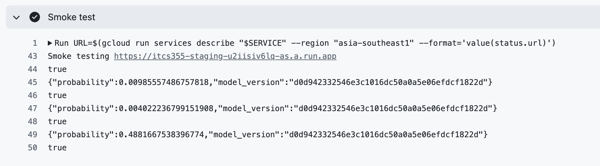
  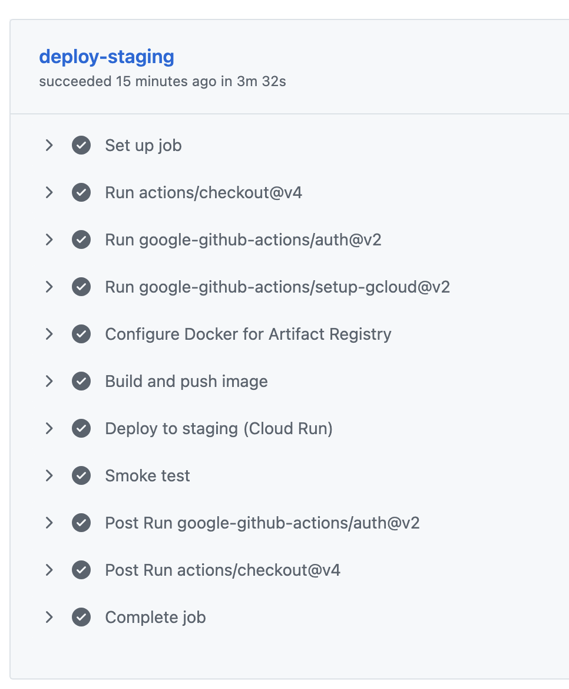
- **One failure, and what it was:** CD #4 failed once at `docker push` with
  `Unauthenticated request ... artifactregistry.repositories.uploadArtifacts`. The registry
  repo and the Cloud Run service were both intact (checked with `gcloud`), the workflow had not
  changed since the green run before it, and re-running the failed job passed with no change.
  Most likely a transient failure exchanging the OIDC token (not confirmed).

### Task 3: Evidence of a blocked bad commit

PR #2 (`lab4-bad-contract`, closed without merging) changed one line in
`scripts/make_dataset.py` so the generated CSV dropped the `vibration_mm_s` column:

```python
df.drop(columns=["vibration_mm_s"]).to_csv(args.out, index=False, lineterminator="\n")
```

- **Failing run:** https://github.com/pearlispearl/public_teaching_mlaiops/actions/runs/37488916012/job/112356150783#step:11:247
- **Where it stopped:** step "Data contract tests". Every step before it (secret scan,
  lint, portability audit, unit tests, generate dataset) passed. "Model behaviour tests"
  and "Service tests" did not run, and the `build` job was skipped because of
  `needs: test`, so nothing was built or shipped.
- **Test that caught it:** `test_schema_columns_present_and_typed`
  (`AssertionError: missing columns: ['vibration_mm_s']`). This is the test that
  names the cause.
- **Also failed (as a consequence):** `test_no_nulls_in_required_columns` and
  `test_features_within_plausible_ranges` raised `KeyError` when they tried to read the
  missing column.
- **Unit tests were unaffected:** the 17 tests in `tests/test_features.py` still passed
  locally, which shows the failure came from the data contract, not from the code.

```
FAILED tests/test_data.py::test_schema_columns_present_and_typed - AssertionError: missing columns: ['vibration_mm_s']
FAILED tests/test_data.py::test_no_nulls_in_required_columns - KeyError: "['vibration_mm_s'] not in index"
FAILED tests/test_data.py::test_features_within_plausible_ranges - KeyError: 'vibration_mm_s'
3 failed, 7 passed
```

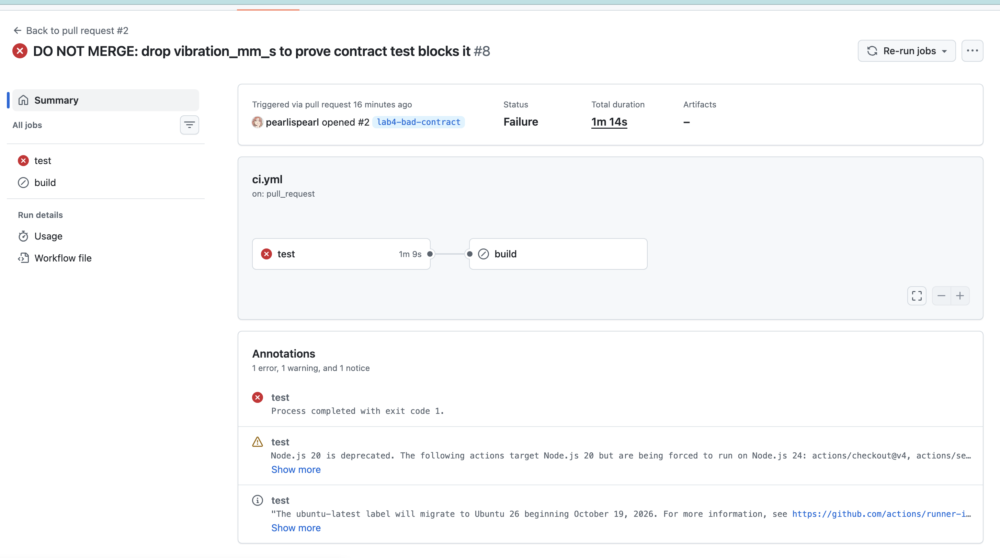
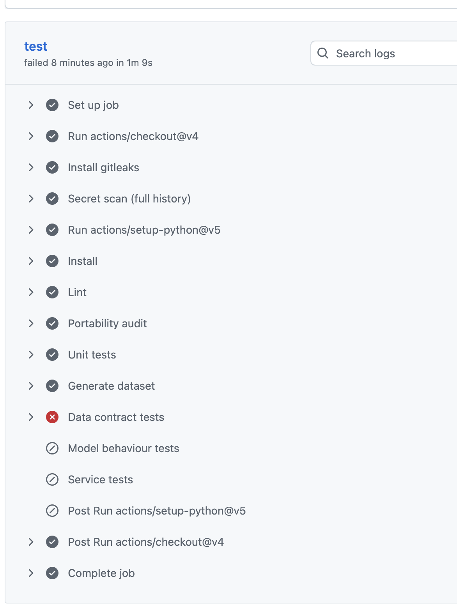
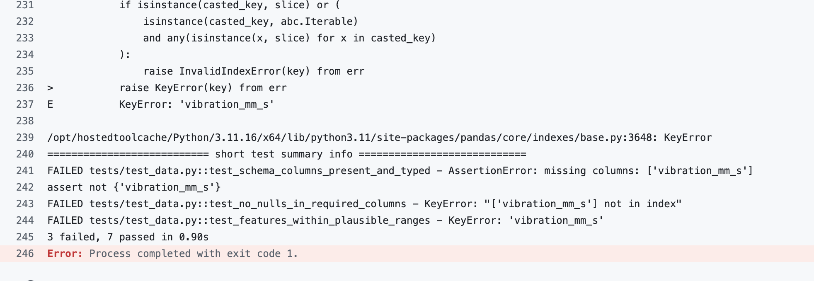

## Task 4: Dashboard and SLO

Dashboard: `monitoring/dashboard_gcp.json` (Cloud Monitoring; create with
`gcloud monitoring dashboards create --config-from-file=monitoring/dashboard_gcp.json`).
The Grafana-format `monitoring/dashboard.json` is kept only as the course reference.

| Signal | Panel | Source |
|---|---|---|
| Request rate | req/s | `run.googleapis.com/request_count` |
| Errors | 4xx and 5xx as separate share-of-requests lines (4xx = caller, 5xx = ours) | `request_count` by `response_code_class` |
| Latency | p50 / p95 / p99 | `run.googleapis.com/request_latencies` |
| Feature distribution | PSI per feature, with the 0.1 alert line | custom metric `custom.googleapis.com/itcs355/drift.psi.<feature>` |
| Model version | requests/s by `model_version` | log-based metric `model_version_requests` |

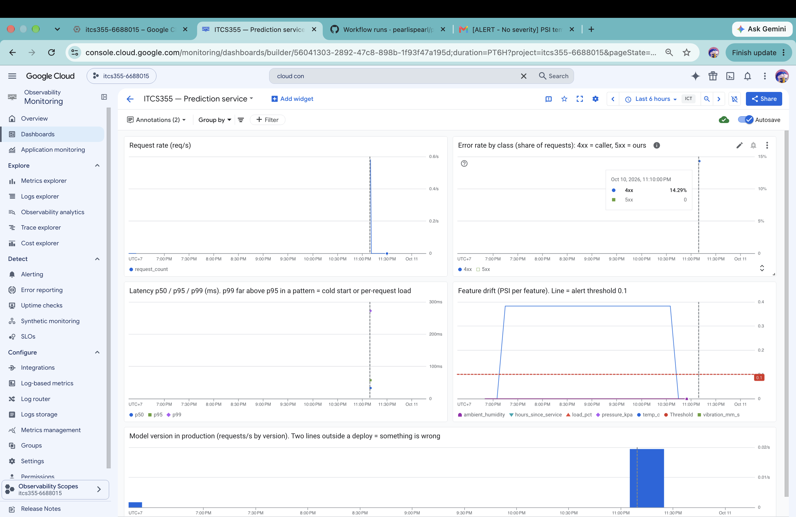

SLO (`monitoring/slo.yaml`): availability 99.5% over 30 days (about 216 minutes of budget),
p95 latency under 200 ms over 7 days, model freshness within 30 days. Every
`on_budget_exhausted` entry names the response (freeze deploys, investigate before shipping).

## Task 5: Scheduled drift detector

- Metric: PSI per feature (10 quantile bins), with two-sample KS printed alongside.
- Threshold: PSI >= 0.10 flags a feature in `drift.py`; the Cloud Monitoring condition is PSI > 0.10 (the
  difference at exactly 0.10 does not matter). Justification and evidence in "Drift threshold" below.
- Job: Cloud Run Job `itcs355-drift` runs `python -m monitoring.run_scheduled`, which fetches the
  reference and current files through the cloud adapter and runs `monitoring.drift --emit`.
  Same image and pinned dependencies as the training image (`Dockerfile`, hashes in `requirements.txt`).
- Schedule: Cloud Scheduler `itcs355-drift-schedule`, every 10 minutes.
- Alert channel: email (Cloud Monitoring notification channel), policy
  `monitoring/alert_drift_policy.json`: one condition per feature, PSI > 0.10, combined with OR.
- Limitation: the service does not log feature values, so "current" is a file in the bucket
  (`drift/current.csv`) rather than live traffic. A production version would log a sample of
  request features and build the current window from that. Windows below ~500 rows make 0.10 unreliable.

### Drift threshold (Task 5)

**PSI >= 0.10 per feature.**

0.10 and 0.25 are the credit-scoring rules of thumb, a setting with stable features and very large
volumes. This data (6,000 rows, 240 machines, readings from one machine correlated) is not that, so the
number is not taken from there. It comes from the two measurements below and happens to coincide with the
credit-scoring value.

- *Lower bound (no false alarms).* With no real change, PSI from sampling noise on `sensors.csv`
  is at most 0.068 across 6,000 draws at a 500-row window (p99 = 0.049), and it falls as the window
  grows (about 0.005 at the full 6,000 rows, extrapolated).
  Measured with `scripts/measure_drift_noise.py`. So 0.10 does not fire on noise at any window of
  500 rows or more.
- *Upper bound (catches real drift).* Injected with `scripts/inject_drift.py` on `temp_c`:

  | Injection | PSI | KS | Caught at 0.10 | Caught at 0.25 |
  |---|---|---|---|---|
  | shift, +6 | 0.383 | 0.246 | yes | yes |
  | scale, x1.5 | 0.206 | 0.114 | yes | **no** |
  | mix (machine weights) | 0.009 | 0.034 | no | no |

  The textbook 0.25 would have missed a 50% increase in spread. 0.10 catches both real shifts with
  at least 2x margin.
- *Which statistic caught which fault.* `scale` leaves the mean of `temp_c` unchanged (79.58) yet PSI reacts
  (0.206) while KS only reaches 0.114, so a check on the mean would have missed it and KS is the weaker alarm for
  a change in spread. `shift` moves the mean and both react (PSI 0.383, KS 0.246). `mix` reweights machines and
  neither reacts (PSI 0.009, KS 0.034).
- *Known blind spot.* A change in the mix of machines moved no single feature enough to separate
  from noise (PSI 0.009), so per-feature PSI cannot catch it. That needs a different signal, such
  as a drop in prediction quality.
- *Caveat.* Rows from one machine are correlated, so real windows are noisier than the experiment;
  the margin is meant to absorb that. If the window falls below 500 rows, re-measure.

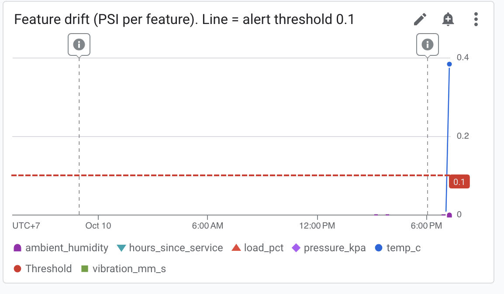

## Task 6: Injected drift

Injection: `python scripts/inject_drift.py --feature temp_c --mode shift --magnitude 6`
(mean of `temp_c` 79.58 -> 85.58), uploaded to the `current.csv` the detector reads.

| Event | Time (UTC) |
|---|---|
| Drift injected (T0) | 12:06:09 |
| Scheduled job runs, logs ALERT | 12:10:00 start, 12:10:30 ALERT line |
| Incident opened, email received | 12:13:06 |
| Reference restored to `current.csv` | 15:37:15 |
| Incident closed ("Alert recovered" email) | about 15:43 (duration 3 h 30 min from 12:13) |

**Detection time: 6 min 57 s** (T0 to incident open): 4 min 21 s until the scheduled job flagged it,
2 min 36 s until Cloud Monitoring opened the incident. This is one trial. The worst case is
roughly the 10-minute schedule plus the policy evaluation delay. The incident stayed open for
3 h 30 min only because I forgot to restore the file after collecting the evidence. That duration
measures my delay, not the detector or a response process.

PSI for `temp_c` was 0.383 both locally and in the alert email (0.38333).

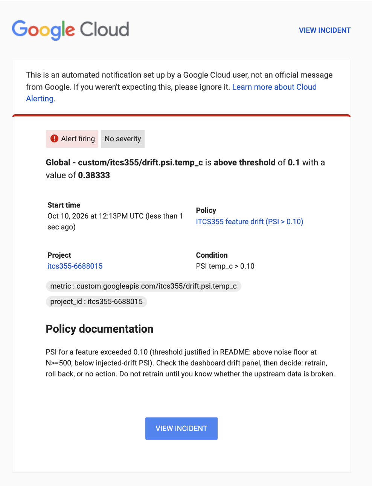
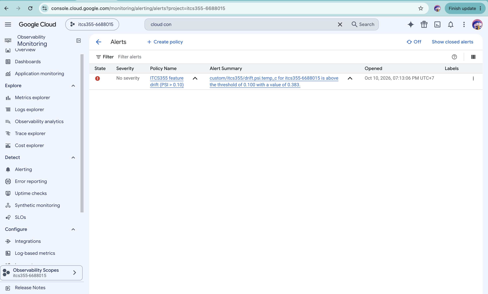
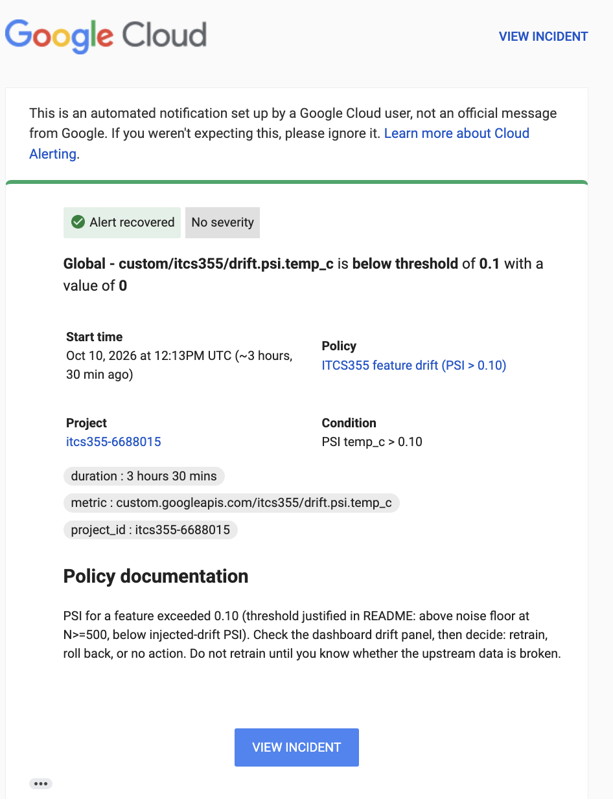
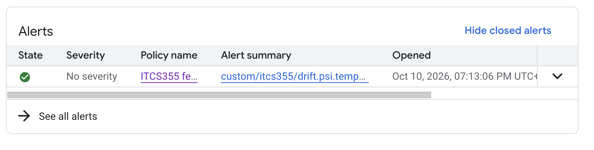
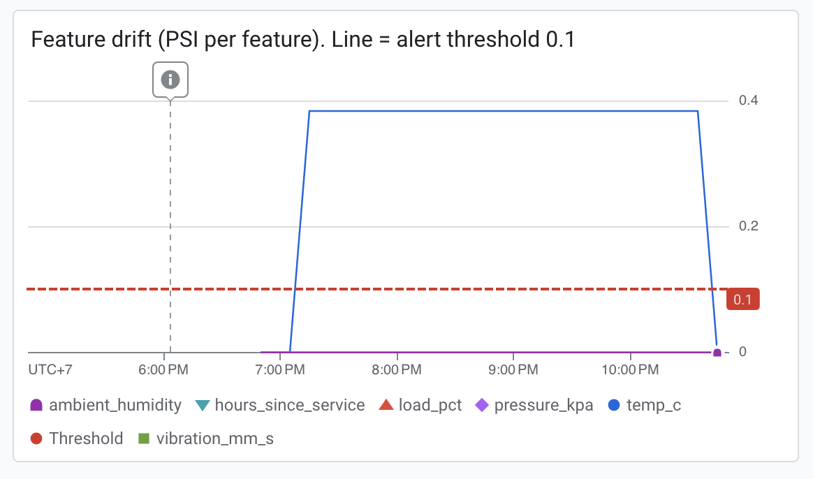

### Post-mortem

The same text, in the course template format, is in `reports/lab4-postmortem.md`.

1. **What fired:** `drift.psi.temp_c` = 0.383 (threshold 0.10) at 12:13 UTC; KS 0.246; the other five features stayed at 0.
2. **True cause:** I injected it: the mean of `temp_c` moved by +6 at 12:06:09 UTC. No real-world change.
3. **Retrain, roll back, or no action:** No action on the model for now. For a real alert I would first check the schema and null rate of the incoming data and whether the sensor or upstream pipeline broke (calibration, unit change, bad batch), because retraining on corrupted data destroys the last good model. I would retrain only if the checks pass, the shifted distribution persists for days, and it matches a real change in the fleet (for example new equipment). Evidence that would change my mind: a schema or null-rate change (then fix the producer and backfill instead), or a fall in prediction quality without any input change (then it is concept drift).
4. **Cost if unnoticed for a week:** An estimate with stated assumptions (`python scripts/estimate_drift_impact.py`). I trained the Lab 1 configuration on the training machines (200 trees, depth 8, seed 20260101) and scored the 1,200 validation rows before and after the same +6 shift. Mean predicted risk goes from 0.104 to 0.126 (+21%), the share of rows above a 0.5 cutoff (my assumption; the service returns only a probability) from 2.08% to 2.58%, and 6% of rows move by more than 0.1. Ranking quality barely changes (AUC 0.836 to 0.837), so a metric that only watches ranking would not notice. At an assumed 1,000 predictions a day that is about 35 extra maintenance flags in a week (0.5 percentage points of 7,000). This assumes the shift is a measurement error, not a real change in the machines, and the model's labels are unchanged. Left alone for a week the fault would also run about 1,440 times longer than the 7 minutes this detector needed.
5. **Prevention:** one concrete change: make `monitoring/run_scheduled.py` run the schema, null-rate and range checks from `tests/test_data.py` on the same current window before it scores drift, and emit a `contract.failed` metric with its own alert. Then a broken upstream feed raises a different alert from a real shift, and nobody retrains on it by reflex. The scheduled detector and email alert stay (detected in about 7 minutes here).
